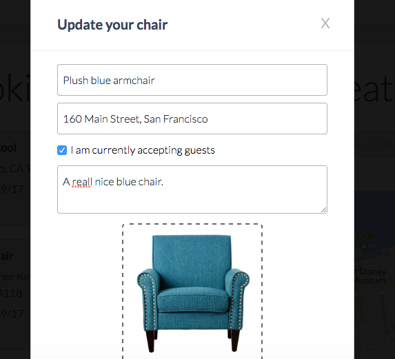
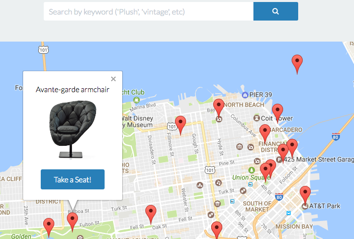

# Repose  

[Live](https://chairsurfing.herokuapp.com/#/)

In the fast-growing urban metropolis that is 21st century San Francisco, urban space is at a premium. Repose is a web app created to meet such demand, empowering users to host each other without sacrificing that most precious commodity: space. Built with Ruby on Rails, React/Redux and PostgreSQL, Repose allows its users to sleep on fine chairs ranging from elegant leather armchairs to straight-backed wooden chairs.


## Technologies

In the typical MVC framework, a user makes a request to a server, which responds with content (a view). Repose, and indeed all applications built with React.js, slightly modify the typical MVC approach: they hit the backend server, in this case built with Ruby on Rails and running a PostgreSQL database, for data which is served up as JSON (Javascript Object Notation). This JSON is then parsed on the frontend and used to build React components, which render as HTML. The backend—Rails—is responsible for serving up these views using a RESTful API.

# Features and Implementation

## Creating, Booking, and Reviewing

On Repose, users may 'create' their own chairs; i.e., they may post them on the app for other users to book. They may also book each other's chairs and approve and deny bookings for their own chair. Lastly, they may leave reviews on other chairs.

Each user can have a maximum of one chair. Users may edit their chair. They upload images using React's React Dropzone library. These images are then posted to Cloudinary, as follows:

```Javascript

upload.end((err, response) => {
  if (err) {
    console.error(err);
  }

  if (response.body.secure_url !== '') {
    this.state.image_url = response.body.secure_url;
    this.state.image = [];
  }

  this.geocodeLocation();
});

```

We are careful to set this.state.image to an empty array, as posting the result of a React Dropzone upload to the Rails backend will result in an error.

Once the upload is complete, we geocode the address given by the user using the Google Maps Geocoding API, as follows:

``` javascript
if (status === 'OK') {
  this.state.lat = results[0].geometry.location.lat();
  this.state.lng = results[0].geometry.location.lng();
  this.state.address = results[0].formatted_address;

```

We set this.state.address to the formatted_address returned by google. This regularizes addresses which may be entered by users with misspellings, dropped zip-codes, etc.

We then post the following image to the backend:



Repose uses React's React Modal library to render its create chair form. This form fetches up the appropriate chair from the Rails backend and pre-fills the fields. (It therefore knows which images to render in the React Dropzone container.)

## Search

Repose allows users to search for chairs by keyword. To avoid making unnecessary server requests, it only searches for chairs within a map's current bounds. (It updates whenever those bounds change.)

```ruby
def self.in_bounds(filters)
  bounds = filters[:bounds]


  north_east = bounds["northEast"]
  south_west = bounds["southWest"]

  chairs = Chair.where("lat < ? AND lat > ?", north_east['lat'], south_west['lat'])
    .where("lng < ? AND lng > ?", north_east['lng'], south_west['lng'])

  unless filters[:keyword] == nil || filters[:keyword] == ''
    chairs = Chair.filter_by_keyword(chairs, filters)
  end

  chairs
end

def self.filter_by_keyword(chairs, filters)
  keyword = '%' + filters[:keyword] + '%'
  chairs.where(
    'description ILIKE ? OR address ILIKE ? OR about ILIKE ?', keyword, keyword, keyword
  )
end
```

This is used to create the following React component, which updates in real-time as the user types:




# Future Improvements

## User Profiles

On Chairsurfing, the website which provides loose inspiration for Repose, users have robust profiles complete with images, reviews and detailed about sections. Implementing such a feature would add depth to Repose and certainly be welcomed by our user-base.

## Messaging

Currently, users may make and approve booking requests; however, adding messaging would make these requests far more potent and meaningful. Doing so would require at the least slight edits to the current booking form (it should accept string input), but could even employ sockets to allow real-time communication.

## Search for more cities

At the moment, Repose is only implemented in San Francisco; therefore, we do not need to handle search by location. In Couchsurfing, however, users can search by city, and as they type in the searchbar, a pre-populated list of suggestions is returned (as when you're searching in google).
